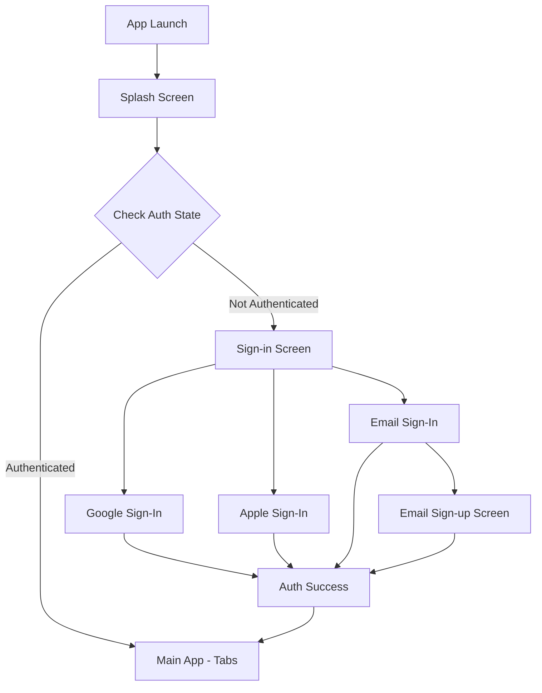

# Task 1.2 - Authentication Setup Implementation Plan

## Overview

This document outlines the implementation plan for Task 1.2 - Authentication Setup using Supabase for the Flight Notes AI application.

## Screens to Implement

Based on the provided HTML designs, we need to implement:

1. **Splash Screen** - Branded loading screen with auth state check
2. **Sign-in Screen** - Social auth options (Google, Apple) + Email link
3. **Sign-up Screen** - Full name, email, password form for registration
4. **Sign-in with Email Screen** - Email and password form for existing users
5. **Forgot Password Screen** - Password reset flow (linked from Sign-in with Email)

---

## Architecture Overview



---

## Implementation Tasks

### 1.2.1 - Configure Supabase Project and Client

**Files to Create/Modify:**

- `src/lib/supabase.ts` - Supabase client configuration
- `src/types/database.ts` - Database types generated from Supabase
- `.env` - Environment variables for Supabase credentials
- `app.config.ts` - Expo config for environment variables

**Dependencies to Install:**

```bash
npx expo install @supabase/supabase-js @supabase/auth-helpers-react
npx expo install expo-secure-store
npx expo install expo-constants
```

**Configuration Steps:**

1. Create Supabase project at supabase.com
2. Enable Google and Apple auth providers in Supabase dashboard
3. Configure OAuth redirect URLs
4. Generate and store API keys in environment variables
5. Create Supabase client with secure storage adapter

---

### 1.2.2 - Implement Google Sign-In

**Dependencies to Install:**

```bash
npx expo install @react-native-google-signin/google-signin
```

**Files to Create:**

- `src/services/auth/google-auth.ts` - Google Sign-In logic
- `src/hooks/use-google-auth.ts` - Hook for Google auth

**Configuration Steps:**

1. Configure Google Cloud Console project
2. Create OAuth 2.0 client IDs for iOS and Android
3. Configure Google provider in Supabase dashboard
4. Add Google configuration to `app.json`
5. Implement sign-in flow with Supabase integration

**iOS Configuration (app.json):**

```json
{
  "expo": {
    "ios": {
      "googleServicesFile": "./GoogleService-Info.plist",
      "bundleIdentifier": "com.flightnotesai.app"
    }
  }
}
```

**Android Configuration (app.json):**

```json
{
  "expo": {
    "android": {
      "googleServicesFile": "./google-services.json",
      "package": "com.flightnotesai.app"
    }
  }
}
```

---

### 1.2.3 - Implement Apple Sign-In

**Dependencies to Install:**

```bash
npx expo install expo-apple-authentication
```

**Files to Create:**

- `src/services/auth/apple-auth.ts` - Apple Sign-In logic
- `src/hooks/use-apple-auth.ts` - Hook for Apple auth

**Configuration Steps:**

1. Enable Apple Sign-In in Apple Developer Console
2. Configure Apple provider in Supabase dashboard
3. Add Apple configuration to `app.json`
4. Implement sign-in flow with Supabase integration

**Requirements:**

- Apple Developer Program membership required
- iOS 13+ required for Apple Sign-In
- Must be built with Xcode for Apple Sign-In to work

---

### 1.2.4 - Build Splash Screen with Auth State Check

**Files to Create:**

- `src/app/splash.tsx` - Splash screen component
- `src/components/splash-screen.tsx` - Animated splash UI component

**Features:**

- Animated logo with pulse effect
- Loading indicator
- Auth state check on mount
- Redirect to appropriate screen based on auth state

**Design Elements from HTML:**

- Purple gradient mesh background
- Animated plane icon with waveform
- "Flight Notes AI" branding
- Loading bar animation
- Version number display

---

### 1.2.5 - Build Sign-in Screen with Social Auth Buttons

**Files to Create:**

- `src/app/auth/sign-in.tsx` - Sign-in screen component
- `src/components/auth/social-auth-buttons.tsx` - Reusable social auth buttons

**Features:**

- Google Sign-In button
- Apple Sign-In button
- Email sign-in link
- Terms of Service and Privacy Policy links
- Background with aviation imagery and grid pattern

**Design Elements from HTML:**

- Dark theme with purple accents
- Logo with gradient glow effect
- Social buttons with icons
- Divider with "or" text
- Legal footer

---

### 1.2.6 - Build Email Sign-up Screen

**Files to Create:**

- `src/app/(auth)/sign-up.tsx` - Sign-up screen component
- `src/components/auth/email-input.tsx` - Reusable email input
- `src/components/auth/password-input.tsx` - Reusable password input

**Features:**

- Full name input
- Email input with validation
- Password input with show/hide toggle
- Password strength indicator (min 8 characters)
- Form validation
- Link to sign-in for existing users

**Design Elements from HTML:**

- Form with icons in input fields
- Password visibility toggle
- "Must be at least 8 characters" hint
- Create Account button with arrow
- Link to sign-in for existing users

---

### 1.2.7 - Build Email Sign-in Screen

**Files to Create:**

- `src/app/(auth)/email-sign-in.tsx` - Email sign-in screen component

**Features:**

- Email input with validation
- Password input with show/hide toggle
- "Forgot Password?" link
- Form validation
- Link to sign-up for new users

**Design Elements from HTML:**

- "Welcome Back" header
- Form with icons in input fields
- Forgot Password link (right-aligned)
- Sign In button
- Link to sign-up for new users

---

### 1.2.8 - Build Forgot Password Screen

**Files to Create:**

- `src/app/(auth)/forgot-password.tsx` - Forgot password screen
- `src/app/(auth)/reset-password.tsx` - Reset password screen (after email link)

**Features:**

- Email input for password reset
- Send reset link button
- Success confirmation with email sent message
- Link back to sign-in

**Design Specification (following existing style):**

- Same dark theme with purple accents
- Logo with gradient glow effect
- "Reset Password" header
- "Enter your email and we'll send you a link to reset your password" subtitle
- Email input with mail icon
- "Send Reset Link" button with primary color
- "Back to Sign In" link
- Background with aviation imagery and grid pattern

**Reset Password Screen Design:**

- "Create New Password" header
- New password input with lock icon
- Confirm password input
- "Reset Password" button
- Success message after reset

---

### 1.2.9 - Implement Protected Route Logic and Auth Context

**Files to Create:**

- `src/contexts/auth-context.tsx` - Auth context provider
- `src/hooks/use-auth.ts` - Hook for auth state and methods
- `src/components/auth/protected-route.tsx` - Route guard component

**Features:**

- Auth state management
- Session persistence
- Protected route wrapper
- Auto-redirect for unauthenticated users
- Sign-out functionality

**Auth Context Structure:**

```typescript
interface AuthContextType {
  user: User | null;
  session: Session | null;
  loading: boolean;
  signInWithGoogle: () => Promise<void>;
  signInWithApple: () => Promise<void>;
  signInWithEmail: (email: string, password: string) => Promise<void>;
  signUpWithEmail: (
    email: string,
    password: string,
    name: string
  ) => Promise<void>;
  signOut: () => Promise<void>;
}
```

---

## File Structure

```
src/
├── app/
│   ├── _layout.tsx          # Root layout with auth provider
│   ├── (auth)/
│   │   ├── _layout.tsx      # Auth stack layout
│   │   ├── sign-in.tsx      # Main sign-in screen (social auth)
│   │   ├── email-sign-in.tsx # Email sign-in screen
│   │   ├── sign-up.tsx      # Sign-up screen
│   │   ├── forgot-password.tsx # Forgot password screen
│   │   └── reset-password.tsx  # Reset password screen
│   └── (tabs)/              # Protected tab navigation
│       └── ...
├── components/
│   ├── auth/
│   │   ├── social-auth-buttons.tsx
│   │   ├── email-input.tsx
│   │   ├── password-input.tsx
│   │   └── protected-route.tsx
│   └── splash-screen.tsx
├── contexts/
│   └── auth-context.tsx
├── hooks/
│   ├── use-auth.ts
│   ├── use-google-auth.ts
│   └── use-apple-auth.ts
├── lib/
│   └── supabase.ts
├── services/
│   └── auth/
│       ├── google-auth.ts
│       └── apple-auth.ts
├── types/
│   ├── database.ts
│   └── auth.ts
└── constants/
    └── theme.ts             # Updated with design colors
```

---

## Theme Updates

Update [`src/constants/theme.ts`](src/constants/theme.ts) with colors from the HTML designs:

```typescript
export const Colors = {
  light: {
    text: "#11181C",
    background: "#f6f6f8",
    tint: "#5b13ec",
    primary: "#5b13ec",
    primaryDark: "#430db0",
    primaryLight: "#7c45f0",
    icon: "#687076",
    tabIconDefault: "#687076",
    tabIconSelected: "#5b13ec",
  },
  dark: {
    text: "#ECEDEE",
    background: "#161022",
    tint: "#7c45f0",
    primary: "#5b13ec",
    primaryDark: "#430db0",
    primaryLight: "#7c45f0",
    icon: "#9BA1A6",
    tabIconDefault: "#9BA1A6",
    tabIconSelected: "#7c45f0",
  },
};
```

---

## Dependencies Summary

| Package                                     | Purpose               |
| ------------------------------------------- | --------------------- |
| `@supabase/supabase-js`                     | Supabase client       |
| `expo-secure-store`                         | Secure token storage  |
| `@react-native-google-signin/google-signin` | Google Sign-In        |
| `expo-apple-authentication`                 | Apple Sign-In         |
| `expo-constants`                            | Environment variables |

---

## Supabase Dashboard Setup Checklist

1. [ ] Create new Supabase project
2. [ ] Note down project URL and anon key
3. [ ] Enable Google provider
   - Add OAuth client IDs
   - Configure redirect URLs
4. [ ] Enable Apple provider
   - Add Apple services ID
   - Configure redirect URLs
5. [ ] Enable Email provider
   - Configure email templates
6. [ ] Create profiles table for user data

---

## Testing Checklist

1. [ ] Splash screen displays correctly
2. [ ] Auth state check works on app launch
3. [ ] Google Sign-In works on iOS
4. [ ] Google Sign-In works on Android
5. [ ] Apple Sign-In works on iOS
6. [ ] Email sign-up creates new user
7. [ ] Email sign-in works for existing users
8. [ ] Session persists across app restarts
9. [ ] Sign-out clears session
10. [ ] Protected routes redirect to sign-in

---

## Notes

- Apple Sign-In requires a paid Apple Developer account and must be tested on a real device
- Google Sign-In requires OAuth 2.0 client IDs configured in Google Cloud Console
- Email authentication is optional per PRD but included in the designs
- All auth flows should handle errors gracefully with user-friendly messages
